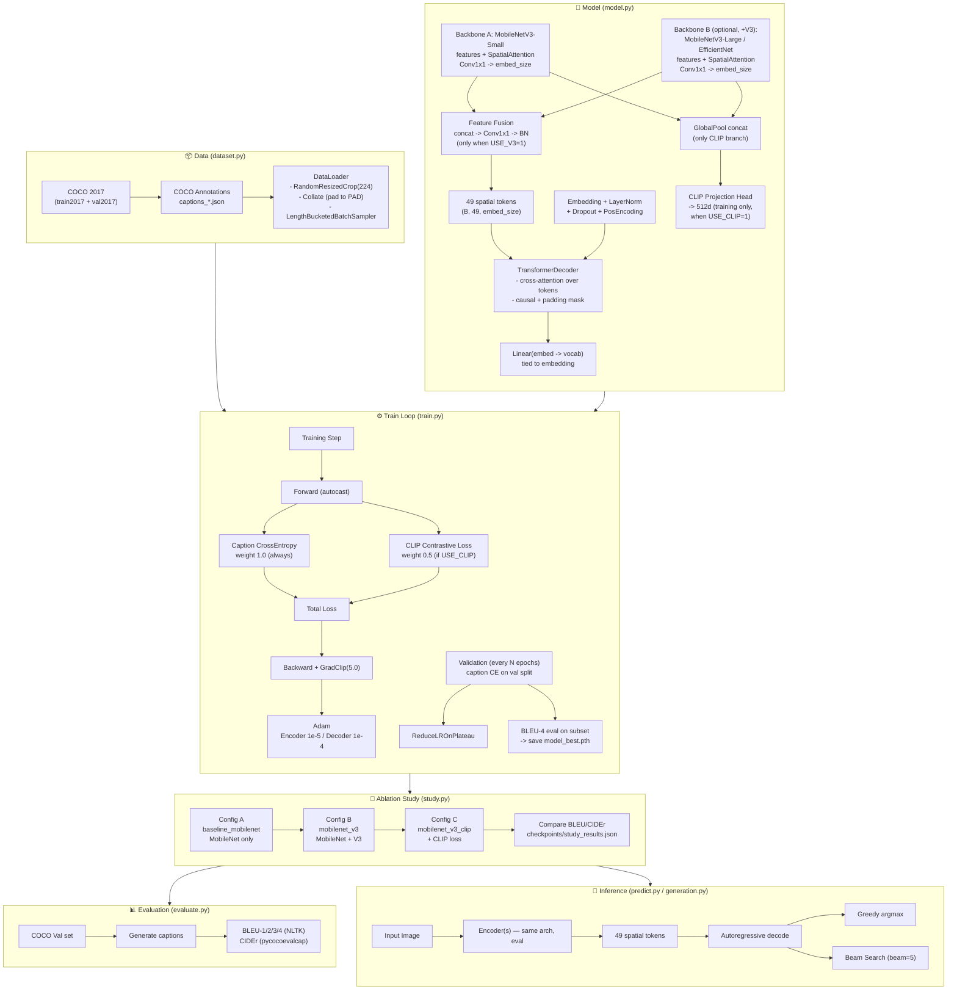

# AI Captioning Project Flowchart

## Ablation study (application study)

Three supervised configs, same pipeline, same COCO data — only the encoder changes:

```
Config A  baseline_mobilenet  : MobileNetV3-Small only
Config B  mobilenet_v3        : MobileNet + V3 encoder branch (feature fusion)
Config C  mobilenet_v3_clip   : MobileNet + V3 + CLIP contrastive loss
```



## CLI commands

```
python -m src.main coco            # download COCO 2017
python -m src.main study           # train all 3 configs, then compare
python -m src.main study-report    # print comparison of finished runs
python -m src.main train           # train default (current) config
python -m src.main evaluate        # BLEU/CIDEr on COCO val
python -m src.main predict  --beam
```

Env overrides to test a single config:

```
STUDY_TAG=baseline_mobilenet  USE_V3=0  USE_CLIP=0  -> Config A
STUDY_TAG=mobilenet_v3        USE_V3=1  USE_CLIP=0  -> Config B
STUDY_TAG=mobilenet_v3_clip   USE_V3=1  USE_CLIP=1  -> Config C
```

## Loss formula

```
total_loss = 1.0 × CrossEntropy(decoder_logits, caption_tokens)     [always]
           + 0.5 × CLIPContrastiveLoss(image_feats, text_feats)     [USE_CLIP=1]

CLIPContrastiveLoss = [CE(img @ text.T / τ) + CE(text @ img.T / τ)] / 2,  τ = 0.07
```