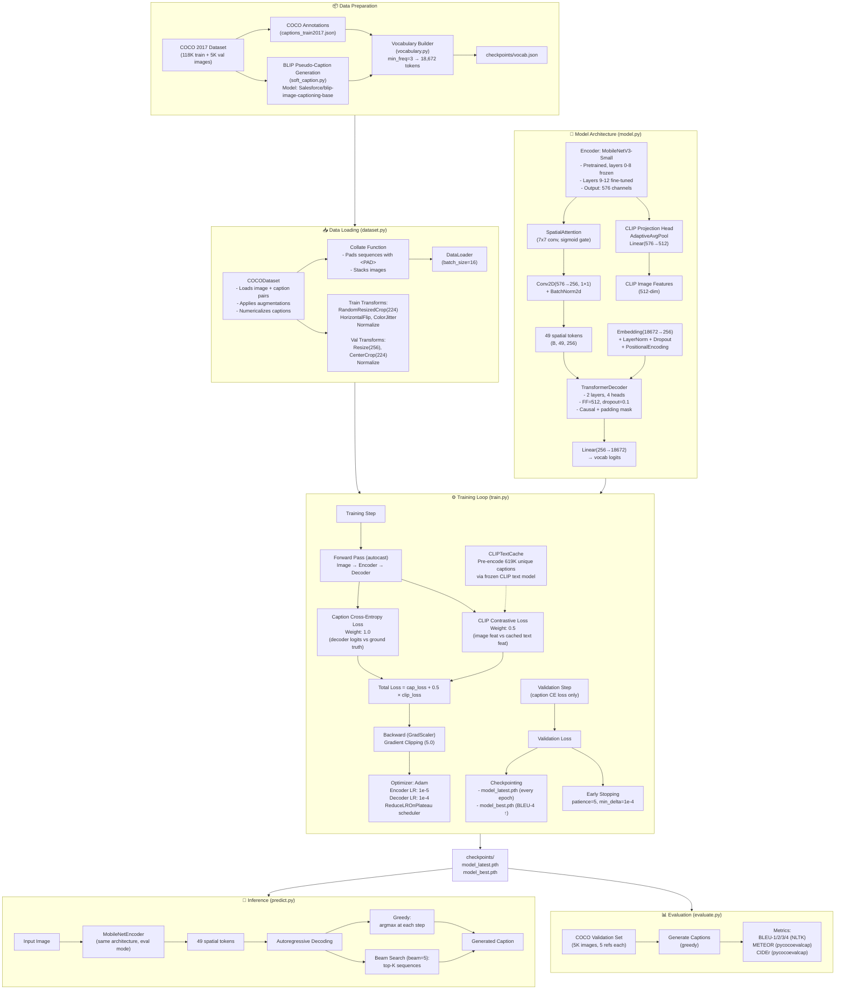

# AI Captioning Project Flowchart



## Pipeline Overview

```
main.py CLI:
  pipeline          → soft-captions → train
  pipeline --skip-captions → train only
  soft-captions     → BLIP pseudo-captions only
  vocab             → build vocabulary only
  train             → train model only
  evaluate          → eval on COCO val set
  predict <image>   → generate caption for image
```

## Loss Formula

```
total_loss = 1.0 × CrossEntropy(decoder_logits, caption_tokens)
           + 0.5 × CLIPContrastiveLoss(image_features, text_features)

CLIPContrastiveLoss = [CE(img @ text.T / τ, labels) + CE(text @ img.T / τ, labels)] / 2
                    where τ = 0.07
```
